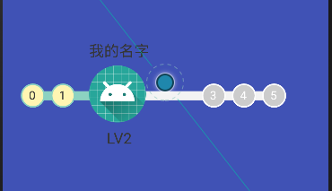

# DisplayLevel
进度显示等级（带动画）

## 介绍
  
## 用法
   | 属性  | 介绍 |
| ---------- | -----------|
| color_jindu | 当前进度颜色   |
| color_quanbujindu   | 全部进度颜色   |
| color_zi_nicheng   | 字体昵称和当前等级的颜色   |
| color_quan_xiao   | 显示未达到等级的小圆环   |
| color_quan_da   | 显示未达到等级的大圆环   |
| color_dangqian_da   | 显示达到等级的大圆环   |
| color_dangqian_xiao   | 显示达到等级的小圆环   |
| color_zi_dangqian   | 显示达到等级的圆环字体颜色   |
| color_zi_quanbu   | 显示未达到等级的圆环字体颜色   |
| dengji_gong   | 一共多少等级   |
| radius_xiao   | 小环半径   |
| radius_tupian   | 大环半径   |
| kuandu   | 进度宽度的一半   |
## 代码

### xml

    <text.qiao.com.displaylevel.MyGradeView
        android:id="@+id/myGradeView"
        android:layout_width="match_parent"
        android:layout_height="140dp"
        android:layout_marginBottom="0dp"
        android:layout_marginEnd="0dp"
        android:layout_marginStart="0dp"
        android:layout_marginTop="0dp"
        app:layout_constraintBottom_toBottomOf="parent"
        app:layout_constraintEnd_toEndOf="parent"
        app:layout_constraintStart_toStartOf="parent"
        app:layout_constraintTop_toTopOf="parent" />
        
 ### activity
        myGradeView.setDengjishu("LV2");
        myGradeView.setNicheng("我的名字");
        myGradeView.setJindu(2);
        myGradeView.start();
 ## 备注
    如有不懂，请阅读源码！
    
-------------------------------------------------------------------------------
[我的博客](https://blog.csdn.net/qq_17098509 "点击进入博客")
  
        
